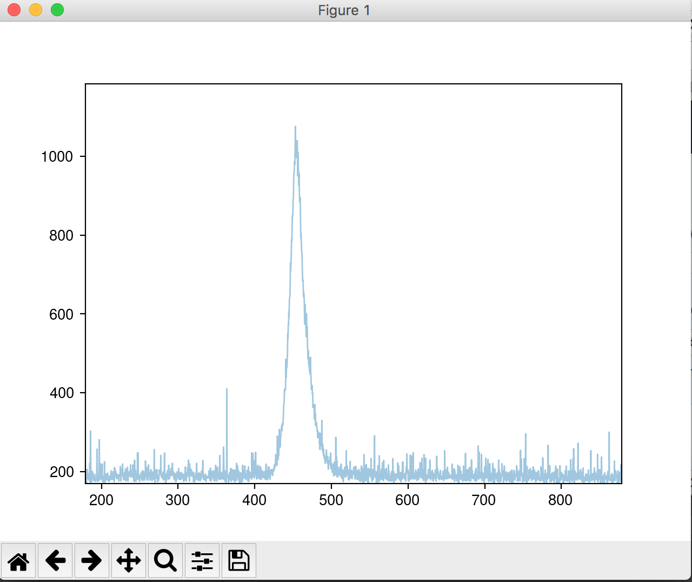

## brizzy: software to easily capture ocean optics spectra

### about

`brizzy` captures data from Ocean Optics spectrometers using their
SeaBreeze API, as well as the
[python seabreeze](https://github.com/ap--/python-seabreeze)
wrapper. **We are not in any way affiliated with Ocean Optics, and
offer no warranty with the use of this software.** On that note, it
has worked great for us so far!

When you're monitoring your spectrum capture, you will get a
live-updating preview like this:

When you're done, exit the monitoring window. `brizzy` now plots all
of the csv data saved from the spectra. In the output directory, you
will have a csv file of every spectrum you observed, and a plot that
looks like this for your spectrum with the lambda max labeled:

### etmology

_Brizzy_ is Australian for breezy. Using this software is a breeze
compared to other spectrum capture software.

### Installation

Brizzy has a few software dependencies. Right now it
is easiest if you install Anaconda, install some dependencies with
`conda`, then install `brizzy` using `pip`.

1. Install [Anaconda](https://www.anaconda.com/download/#macos) on
   your computer. Scroll down the page and click Python 3.6 version's
   `Download` button. Anaconda is just a fancy distribution of python
   that has useful packages already installed, and makes it easier to
   install new ones.
2. Open the `terminal` application on your computer. Try out
   [iTerm2](https://www.iterm2.com/) for Mac OSX if you have never
   worked with the command line.
3. Install the
   [python seabreeze](https://github.com/ap--/python-seabreeze)
   package using the command line. Copy and paste this exactly into
   your terminal: `conda install -c poehlmann python-seabreeze`. You
   need to install this to let python communicate with your Ocean
   Optics Spectrometer.
4. Now, make sure that you are using the Anaconda version of python by
   typing this into your terminal: `python`. You should see something
   starting like this: `Python 3.x.x |Anaconda custom (x86_64)|
   (default, <date here>)`. If you don't see this, then anaconda
   didn't install properly somehow and you are probably using the
   default system python. Type: `exit()` to get out of the python
   prompt.
4. Now, install `brizzy` by copy/pasting this into your terminal: `pip
   install brizzy`.
5. You're done! Cheers mate! 🍻

### usage

- To capture a spectrum from something, start the program in the
command line using `brizzy capture`.  brizzy capture -i 1000 -d
- To capture a spectrum with an integration time of 233 milliseconds:
  - `brizzy capture -i 233`
- To save all the files to a directory called `mystery_snail`:
  - `brizzy capture -i 233 -d mystery_snail`
- To save all the files with a prefix `mystery_snail_species1` to a directory called `mystery_snail`:
  - `brizzy capture -i 233 -d mystery_snail -p mystery_snail_species1`
